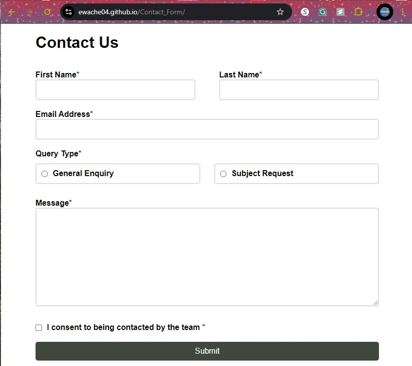
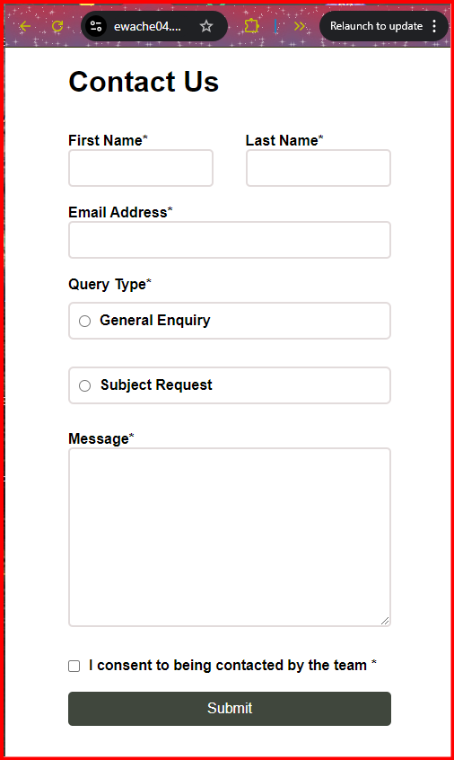

# Contact Form Application

This project is a simple **Contact Form** built using HTML, CSS, JavaScript (with jQuery), and a responsive design approach. It includes a modal feature that displays user inputs upon form submission.

## Screenshots
  


## Overview

Building accessible forms is a crucial task for front-end developers. This contact form application will help you practice creating forms with various input types and validation techniques. This project is based on a challenge from [Frontend Mentor](https://www.frontendmentor.io/challenges/contact-form--G-hYlqKJj).

## Table of Contents

- [Features](#features)
- [Technologies](#technologies)
- [Setup and Deployment](#setup-and-deployment)
- [Usage](#usage)
- [Code Overview](#code-overview)
- [Contributing](#contributing)
- [License](#license)

## Features

- **Responsive Design:** Adapts layout for different screen sizes.
- **Form Validation:** Leverages HTML5 form validation to ensure fields are filled correctly.
- **Modal Display:** Shows submitted data in a modal upon successful submission.
- **Form Reset:** Resets form inputs after closing the modal.

## Technologies

- **HTML5**
- **CSS3**
- **JavaScript (Vanilla + jQuery)**
- **Bootstrap (for layout and styling)**

## Setup and Deployment

To run this project locally, follow these steps:

### Prerequisites

1. Ensure **Git** and a modern web browser are installed.
2. Optionally, set up a local server like [XAMPP](https://www.apachefriends.org/index.html), [MAMP](https://www.mamp.info/en/), or use [Live Server](https://marketplace.visualstudio.com/items?itemName=ritwickdey.LiveServer) for viewing the HTML files.

### Installation Steps

1. **Clone the repository:**

   ```bash
   git clone <repository-url>
   ```

2. **Navigate to the project folder:**

   ```bash
   cd <project-folder>
   ```

3. **Open `index.html` in a browser:**

   - For local servers, place the project folder in the server's `htdocs` directory (or equivalent) and access it through a browser. Example URL:

     ```
     http://localhost/contact-form/
     ```

## Project Structure

```
Contact_Form/
│
├── Demo-Video/                        # Folder containing demo video
│   └── Demo-Video.mp4                 # The actual demo video file
│
├── Screenshots/                       # Folder containing screenshots
│   ├── Contact-Form-Desktop.jpg       # Screenshot for desktop view
│   └── Contact-Form-Mobile.png        # Screenshot for mobile view
│
├── css/                               # Folder containing CSS styles
│   └── styles.css                     # Main stylesheet
│
├── js/                                # Folder containing JavaScript
│   └── script.js                      # JavaScript logic for the contact form
│
├── index.html                         # Main HTML template file
├── LICENSE                            # License information (optional)
└── README.md                          # Project documentation
```

## Usage

1. Fill out the contact form by entering the required fields: first name, last name, email, and message.
2. Select the query type (General Inquiry or Subject Request).
3. Click the **Submit** button.
4. A modal will display the form submission data.
5. Close the modal to reset the form and allow new entries.

## Code Overview

### HTML (index.html)

- The form includes inputs for first name, last name, email, and message.
- A radio button group allows users to select a query type.
- Additional elements include a consent checkbox and a submit button.

### CSS (styles.css)

- The layout uses a flexible grid system for responsive design.
- Custom styles are applied for form elements, the modal, and buttons.
- A basic CSS reset ensures consistent styling across browsers.

### JavaScript (script.js)

- The form submission triggers a function to display entered data in a modal.
- **adjustColumns()** adjusts form layout based on screen width.
- **handleFormSubmit()** gathers form data and displays it in a modal.
- **closeModal()** hides the modal and resets the form inputs.
- Event listeners handle form submission, modal closing, and window resizing.

## Contributing

Contributions are welcome! To contribute:

1. Fork the repository.
2. Create a branch for your feature or bug fix.
3. Commit and push your changes.
4. Open a Pull Request and provide a description of your changes.

Ensure your code follows best practices and includes proper comments and commit messages.

## License

This project is licensed under the MIT License - see the [LICENSE](LICENSE) file for details.

---